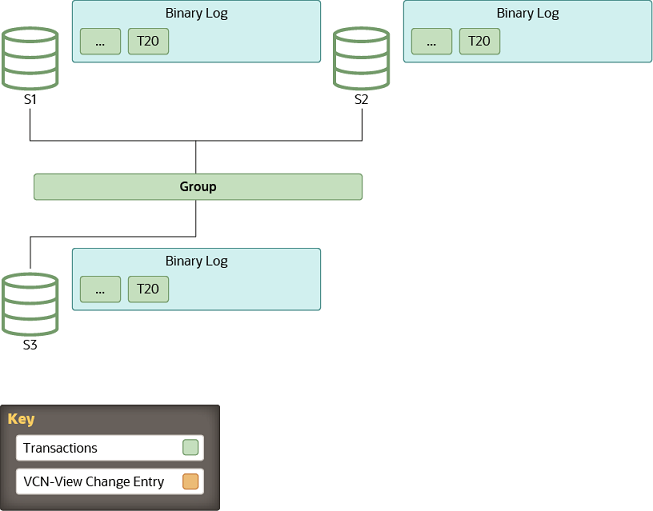
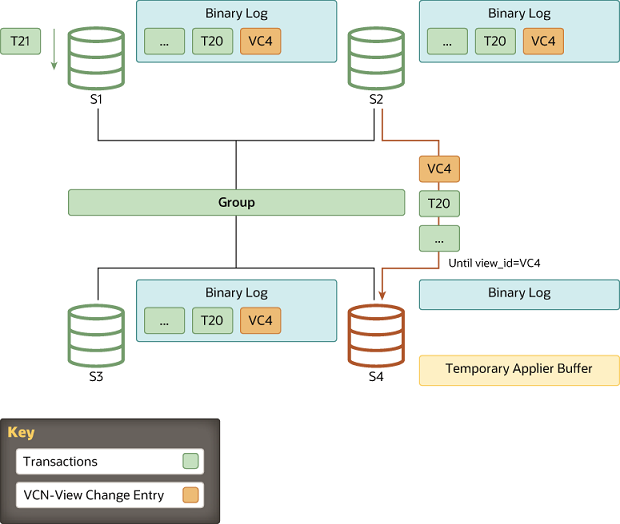

## 分布式恢复的工作原理

>当组复制的分布式恢复过程从二进制日志执行状态传输时，为了将加入成员与 `donor` 同步到特定时间点，加入成员和 `donor` 将使用 `GTID`（全局事务标识符进行复制）。但是，`GTID` 仅提供一种实现加入成员缺少哪些事务的方法。它们不会帮助标记加入组的服务器必须赶上的特定时间点，也不会传达认证信息。这是二进制日志视图标记的工作，用于标记二进制日志流中的视图更改，还包含其他元数据信息，从而为加入成员提供缺少的认证相关数据。

### View and View Changes

- View
> 视图对应于积极参与当前配置的一组成员

- View Changes

>当对组配置进行修改（例如成员加入或离开）时，将发生视图更改。任何组成员资格更改都会导致在同一逻辑时间点向所有成员传达独立的视图更改。

- View identifier

>唯一标识视图。每当视图发生更改时，都会生成它。
>在组通信层，视图更改及其关联的视图标识符标记成员加入前后交换的数据之间的边界。此概念是通过二进制日志事件实现的：“查看更改日志事件”（VCLE）。记录视图标识符是为了划分组成员资格发生更改之前和之后传输的事务。

### Begin

- Stable Group

>所有服务器都处于联机状态，一个最小的组由三台节点构成

### View Change

- A Member Joins

>成员加入从成员服务通过视图抽象声明的在线服务器列表中选择合适的 donor。成员在视图 4 上加入，联机成员将视图更改事件写入二进制日志。

### State Transfer

- Catching Up

>由于视图标识符在同一逻辑时间传输到组中的所有成员，因此加入组的服务器知道它应该在哪个视图标识符处停止复制。这避免了复杂的 GTID 集计算，因为视图标识符清楚地标记了哪些数据属于每个组视图。

### Figure

- Queued Transactions

>当加入组的服务器识别出具有预期视图标识符的视图更改日志事件时，与 donor 的连接将终止，并开始应用缓存的事务

### Finish

- Caught Up

>当加入组的服务器达到零个排队事务，并且其存储的数据与其他成员相等时，其公共状态将更改为 online。

