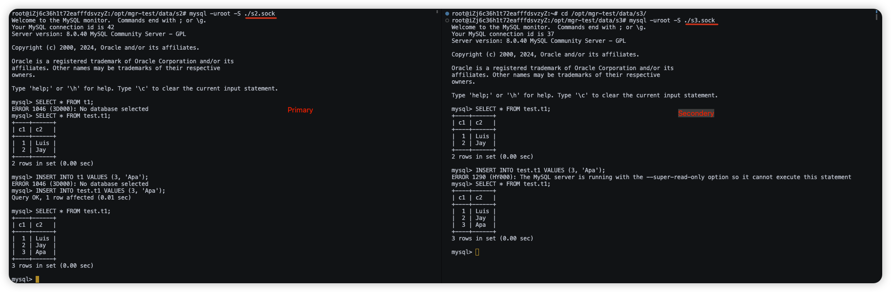
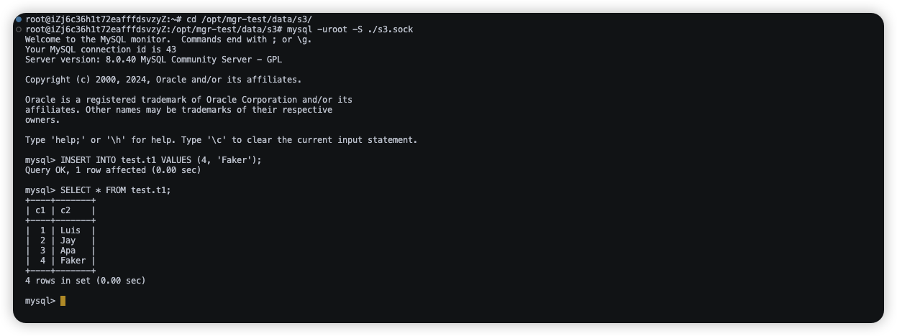
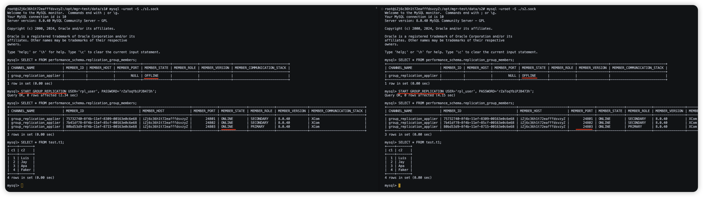

### 查看当前组成员信息、和 primary 节点.

```sql
mysql> SELECT * FROM performance_schema.replication_group_members;
+---------------------------+--------------------------------------+-------------------------+-------------+--------------+-------------+----------------+----------------------------+
| CHANNEL_NAME              | MEMBER_ID                            | MEMBER_HOST             | MEMBER_PORT | MEMBER_STATE | MEMBER_ROLE | MEMBER_VERSION | MEMBER_COMMUNICATION_STACK |
+---------------------------+--------------------------------------+-------------------------+-------------+--------------+-------------+----------------+----------------------------+
| group_replication_applier | 75732740-8f4b-11ef-8309-00163e0c6e68 | 节点一 |       24801 | ONLINE       | PRIMARY     | 8.0.40         | XCom                       |
| group_replication_applier | 7b41df78-8f4b-11ef-85cf-00163e0c6e68 | 节点二 |       24802 | ONLINE       | SECONDARY   | 8.0.40         | XCom                       |
| group_replication_applier | 80bd53d9-8f4b-11ef-8715-00163e0c6e68 | 节点二 |       24803 | ONLINE       | SECONDARY   | 8.0.40         | XCom                       |
+---------------------------+--------------------------------------+-------------------------+-------------+--------------+-------------+----------------+----------------------------+
3 rows in set (0.00 sec)
```

### 关闭节点一并观察节点二/三日志

- 节点二日志

```txt
(省略...)  [Repl] Plugin group_replication reported: 'Members removed from the group: 节点一:24801'
(省略...) [Repl] Plugin group_replication reported: 'Primary server with address 节点一:24801 left the group. Electing new Primary.'
(省略...) [Repl] Plugin group_replication reported: 'A new primary with address 节点二:24802 was elected. The new primary will execute all previous group transactions before allowing writes.'
(省略...) [Repl] Plugin group_replication reported: 'Group membership changed to 节点二:24802, 节点三:24803 on view 17294746583942191:4.'
(省略...)  [Repl] Plugin group_replication reported: 'Setting super_read_only=ON.'
(省略...)  [Repl] Plugin group_replication reported: 'The member action "mysql_disable_super_read_only_if_primary" for event "AFTER_PRIMARY_ELECTION" with priority "1" will be run.'
(省略...)  [Repl] Plugin group_replication reported: 'Setting super_read_only=OFF.'
(省略...)  [Repl] Plugin group_replication reported: 'The member action "mysql_start_failover_channels_if_primary" for event "AFTER_PRIMARY_ELECTION" with priority "10" will be run.'
(省略...)  [Repl] Plugin group_replication reported: 'This server is working as primary member.'
```

- 节点三日志
```txt
(省略...) [Repl] Plugin group_replication reported: 'Members removed from the group: 节点一:24801'
(省略...) [Repl] Plugin group_replication reported: 'Primary server with address 节点一:24801 left the group. Electing new Primary.'
(省略...) [Repl] Plugin group_replication reported: 'A new primary with address 节点二:24802 was elected. The new primary will execute all previous group transactions before allowing writes.'
(省略...) [Repl] Plugin group_replication reported: 'Group membership changed to 节点二:24802, 节点三:24803 on view 17294746583942191:4.'
(省略...) [Repl] Plugin group_replication reported: 'Setting super_read_only=ON.'
(省略...) [Repl] Plugin group_replication reported: 'This server is working as secondary member with primary member address 节点二:24802.'
```

### 再次检查当前组成员信息
```sql
mysql> SELECT * FROM performance_schema.replication_group_members;
+---------------------------+--------------------------------------+-------------------------+-------------+--------------+-------------+----------------+----------------------------+
| CHANNEL_NAME              | MEMBER_ID                            | MEMBER_HOST             | MEMBER_PORT | MEMBER_STATE | MEMBER_ROLE | MEMBER_VERSION | MEMBER_COMMUNICATION_STACK |
+---------------------------+--------------------------------------+-------------------------+-------------+--------------+-------------+----------------+----------------------------+
| group_replication_applier | 7b41df78-8f4b-11ef-85cf-00163e0c6e68 | 节点二 |       24802 | ONLINE       | PRIMARY     | 8.0.40         | XCom                       |
| group_replication_applier | 80bd53d9-8f4b-11ef-8715-00163e0c6e68 | 节点三 |       24803 | ONLINE       | SECONDARY   | 8.0.40         | XCom                       |
+---------------------------+--------------------------------------+-------------------------+-------------+--------------+-------------+----------------+----------------------------+
2 rows in set (0.00 sec)
```

### 写入测试观察同步是否正常



### 继续关闭节点二，观察节点三日志

- 节点三日志
```txt
(省略...) [Repl] Plugin group_replication reported: 'Members removed from the group: 节点二:24802'
(省略...) [Repl] Plugin group_replication reported: 'Primary server with address 节点二:24802 left the group. Electing new Primary.'
(省略...) [Repl] Plugin group_replication reported: 'A new primary with address 节点三:24803 was elected. The new primary will execute all previous group transactions before allowing writes.'
(省略...) [Repl] Plugin group_replication reported: 'Group membership changed to 节点三:24803 on view 17294746583942191:5.'
(省略...) [Repl] Plugin group_replication reported: 'Setting super_read_only=ON.'
(省略...) [Repl] Plugin group_replication reported: 'The member action "mysql_disable_super_read_only_if_primary" for event "AFTER_PRIMARY_ELECTION" with priority "1" will be run.'
(省略...) [Repl] Plugin group_replication reported: 'Setting super_read_only=OFF.'
(省略...) [Repl] Plugin group_replication reported: 'The member action "mysql_start_failover_channels_if_primary" for event "AFTER_PRIMARY_ELECTION" with priority "10" will be run.'
(省略...) [Repl] Plugin group_replication reported: 'This server is working as primary member.'
```

### 测试写入




### 恢复节点一和节点二



## 总结

只要有1台主机存活，整个 mysql 服务就可用，在故障主机恢复之后，组复制会自动同步数据，恢复组复制状态。